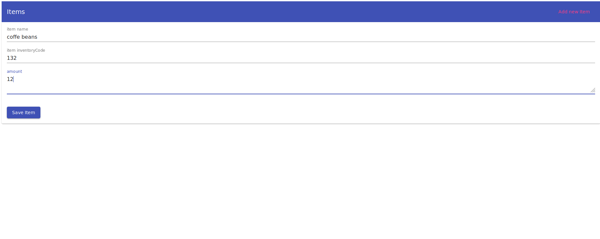
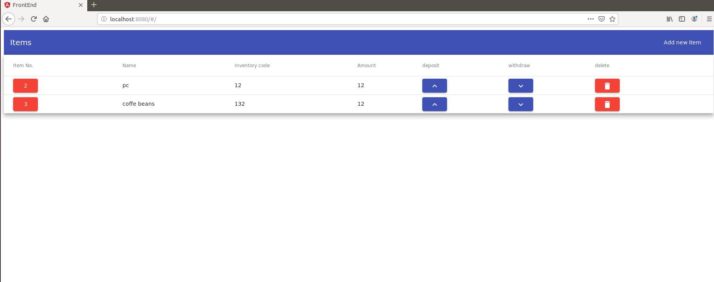
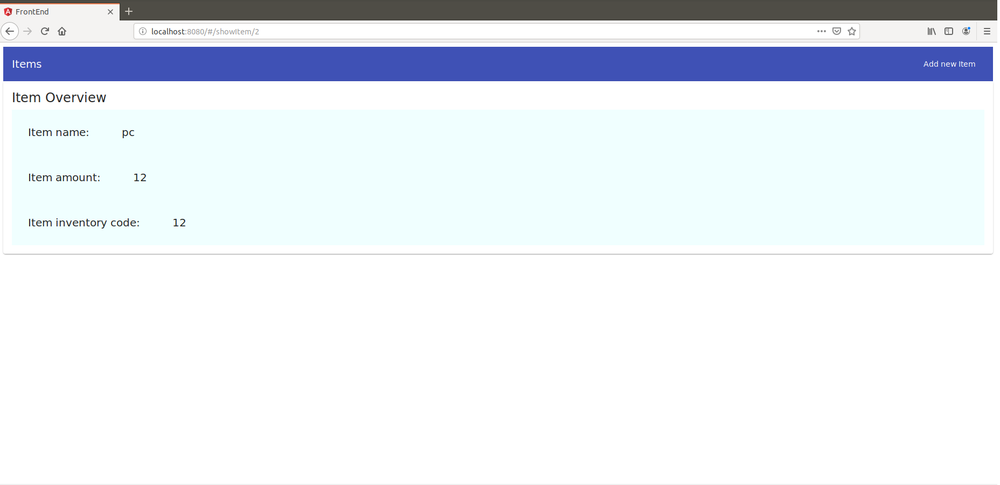
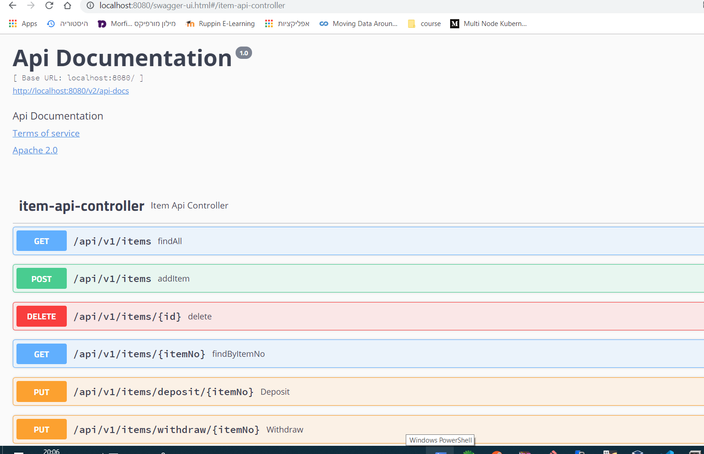

# Item  simple rest Api
using spring boot as backend 
and angular for frontend
enabling to post,delete,put a item
## add a item

## show items
also enable delete item from here,look on specific one via the red buttons.deposit/withdraw(update item amount). 

## show only one

## swagger ui
also you can take via swagger ui on the rest api http://localhost:8080/swagger-ui.html (8080 is the default port of the server).

## docker image also exist for fast deploy on any system that contain docker engine  
use docker pull guygo/item-image for pulling the image
and docker run -p 8080:8080 -it -d guygo/item-image for starting the app
and than go to localhost 8080

